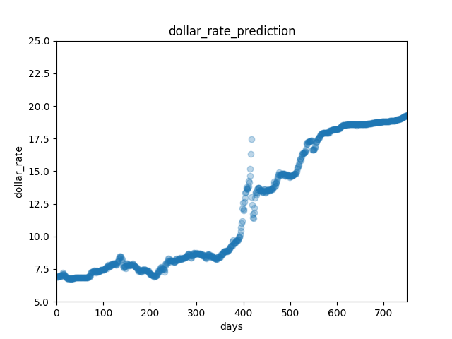
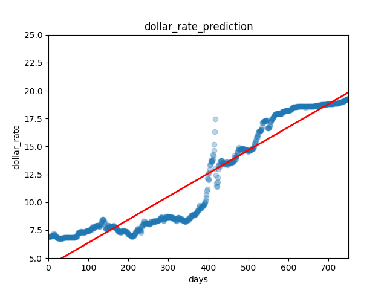

# Dollar Rate Prediction using Linear Regression
This is a machine learning model that predicts the dollar rate using linear regression. The model is built using Python.

## Getting Started
To get started with this project, you will need to clone this repository to your local machine.

## Prerequisites
Make sure you have the following software installed on your local machine:

* Python 3
* NumPy
* Pandas
* Scikit Learn

## Running the Model
You can run the model by running the `main.py` file. The file reads the data from file, and trains the model.

````
python main.py
````




## Contributing
If you would like to contribute to this project, feel free to submit a pull request.

## License
This project is licensed under the MIT license.
